# BeeDBD-Bee

[DBD](../../)
[简介](#introduction)
[资源](#resources)
[细节](#detail)
[尺寸](#size)
[布局](#interface)
[传感器](#sensor)
[软件](#tuner)
[模式](#operationmode)
[开发](#sdk)
[视频](#videos)

## Bee

### 简介

---

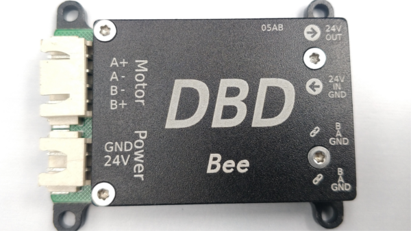
Bee是DBD团队开发的一款超小型创客神器,尺寸只有50mm x 30mm x 9mm, 它采用ARM Cortex-M0内核的32位处理器, 主频80MHz,
独立MOS驱动,
运行空间矢量控制算法及动态力矩调节算法, 可以完美控制86 57 42 35 28 20等型号步进电机.
Bee小巧精致, 接口丰富, 拥有2个IO接口,一路输入IO,一路输出IO.

---

### 资源特性

---

|  |  |
| --- | --- |
| 重量 | 32g |
| 电机 | 4线2相步进电机 |
| 细分 | 256 |
| 工作电压 | DC12V/24V |
| 最大持续输出电流 | 3A |
| PWM频率 | 20KHz |
| 输入IO | 1路(内部10K电阻上拉) |
| 输出IO | 1路 (开漏输出500mA) |
| RS485总线 | 默认250Kbps |
| 运行温度 | -10 to +60摄氏度 |

---

### 产品细节

---

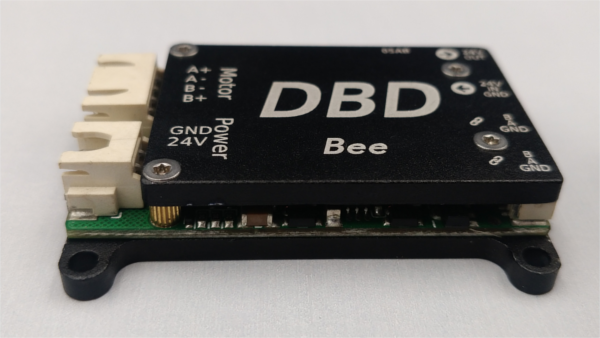
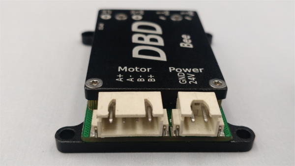
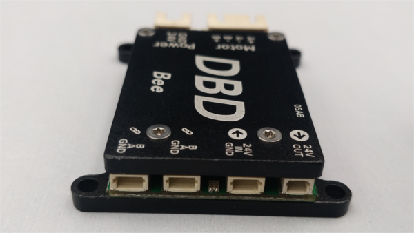
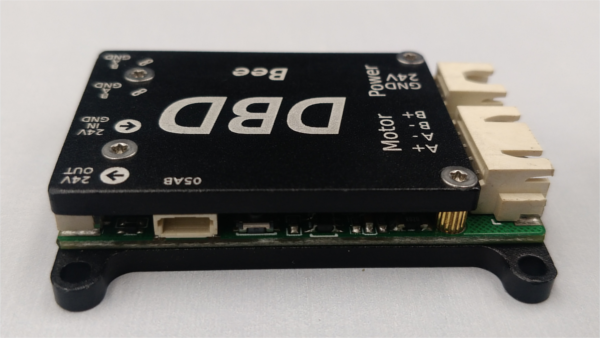

---

### 机械尺寸

---

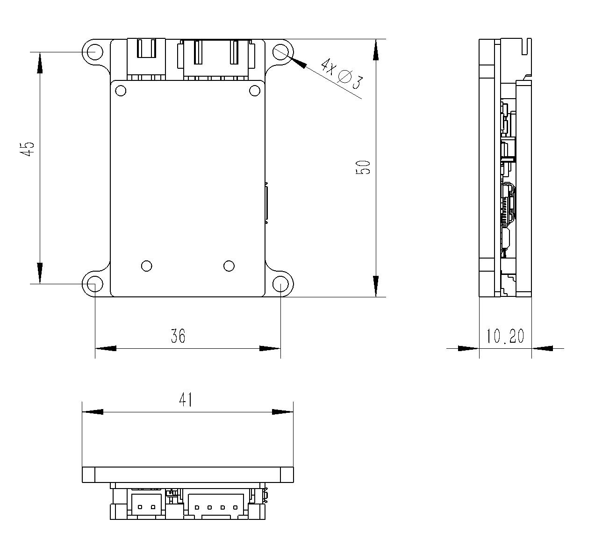

---

### 接口布局

---

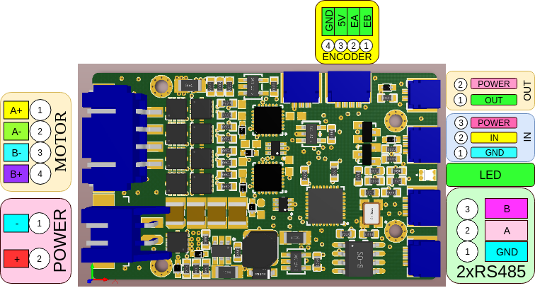

---

### 传感器接口

---

传感器接口采用SH1.0-3P接插件,三个信号分别为GND,INPUT,24V.其中24V为电源的供电电压,即当使用12V作为供电电压时,
向传感器提供12V的电压.INPUT信号为内部10K电阻上拉.下面介绍集中常用的回零传感器接法及注意事项.

#### 两脚触碰开关

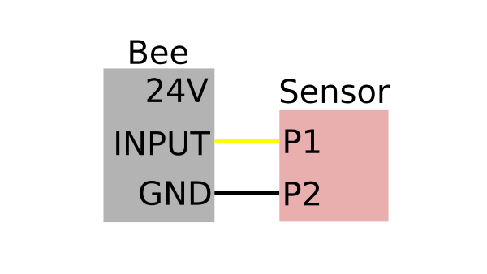

#### 三脚触碰开关

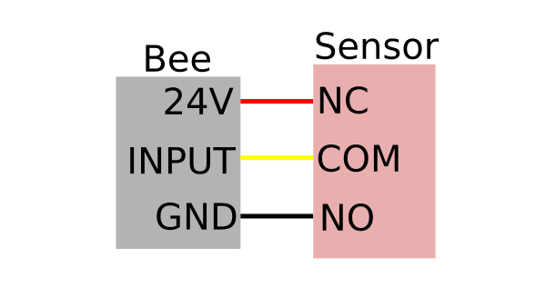

#### 光电传感器

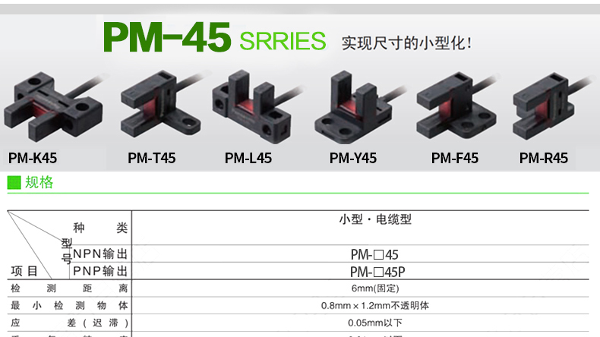
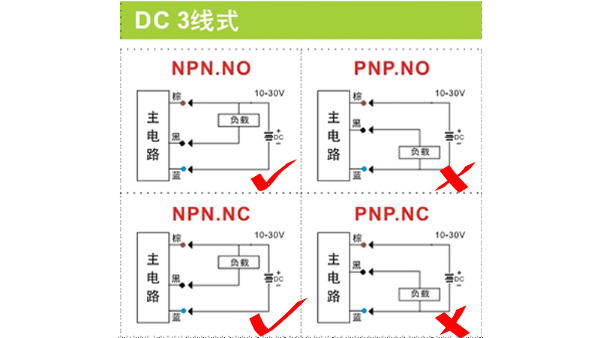

#### 霍尔传感器

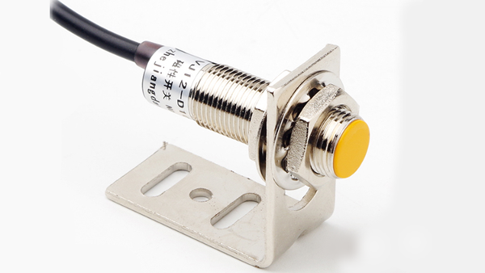

#### PNP

---

### 调试软件

---

#### DBD Tuner for Windows

[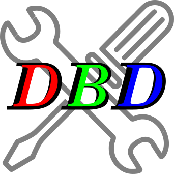](downloads/DBD-Tuner.zip)

---

### 运行模式

---

|  |  |
| --- | --- |
| 位置模式 | 位置模式,全称平滑位置模式.通常称为点位运动.根据设定的目标位置,目标速度以及加速时间 自行规划位置时间曲线并开始运动.  位置模式常用API及参数：    速度－时间曲线：    API使用流程示意图： |
| 速度模式 | 速度模式,全称平滑速度模式,根据设定读目标速度和加速时间自行规划速度时间曲线并开始运动. 该模式的控制对象是电机的运行速度,不关心电机的位置. |
| 回零模式 | 进入回零模式后,根据设定的回零方向和目标速度开始运动,直到传感器触发,达到设置回零电平参数后停止运行, 并且自动将运行模式恢复为进入回零模式前的运行模式. |
| 插补模式 | 插补模式全称同步位置插补模式,用于实现8轴/32轴/256轴电机的同步插补运动.该模式通常用于3D打印机,写字机,画图机,雕刻机, 点胶机等需要多轴联动,并且执行连续轨迹的设备. |

---

### 开发者

---

#### Python SDK(专用USB485转换器)

  

#### Python SDK(通用USB485转换器)

  

---

#### SDK接口

##### Python SDK接口说明

SDK接口分为4类,参数设置set类,参数获取get类,等待信号wait类,功能操作类,下面将做详细介绍.

|  |  |
| --- | --- |
| setPowerOn(id) | 设置对应id号的状态为使能,使能后电机开始受驱动器控制.使能后状态指示灯由快速闪烁变为慢速闪烁. |
| setPowerOff(id) | 设置对应id号的状态为失能,失能后电机不再受驱动器控制.失能后状态指示灯由慢速闪烁变为快速闪烁. |
| setTargetVelocity(id, value) | 设置目标速度.数值范围通常位1-300,单位pulse/ms近似等于RPM. |
| setTargetPosition(id, value) | 设置目标位置.Ant控制1.8度步进电机时,51200脉冲当量对应一圈. |
| setVelocityMode(id) | 设置运行模式为平滑速度模式,详细内容参考[运行模式](#operationmode) |
| setPositionMode(id) | 设置运行模式为平滑位置模式,详细内容参考[运行模式](#operationmode) |
| setHomingMode(id) | 设置运行模式为回零模式,详细内容参考[运行模式](#operationmode) |
| setHomingDirection(id, value) | 设置回零方向.取值为1或者-1. |
| setHomingLevel(id, value) | 设置回零电平.取值为1或者0. |
| setRunningCurrent(id, value) | 设置运行电流.取值范围100-1500,单位mA,通常300-800比较合理. |
| setKeepingCurrent(id, value) | 设置保持电流.取值范围100-1500,单位mA,通常300-800比较合理. |
| setAccTime(id, value) | 设置加速时间.在位置模式下或者速度模式下的加减速过程的时间,单位ms.通常100-2000比较合理. |
| setOutputIO(id, value) | 设置IO输出.取值0或者1. |
| getInputIO(id) | 获取输入IO的状态.返回值为0或者1. |
| getActualVelocity(id) | 获取当前的实际运行速度. |
| getActualPosition(id) | 获取当前的实际位置. |
| getTargetVelocity(id) | 获取目标速度. |
| getTargetPosition(id) | 获取目标位置. |
| getRunningCurrent(id) | 获取运行电流. |
| getKeepingCurrent(id) | 获取保持电流. |
| getAccTime(id) | 获取加速时间. |
| getHomingDirection(id) | 获取回零方向. |
| getHomingLevel(id) | 获取回零电平. |
| waitHomingDone(id) | 等待回零完成. |
| waitTargetPositionReached(id) | 等待目标位置到达. |
| getDeviceID(id) | 获取设备ID. |
| scanDevices() | 扫描在线设备. |
| saveParameters(id) | 保存参数. |
| changeID(id, value) | 修改ID.ID范围0-31. |

##### 如何使用Python SDK

###### 准备工作

1.安装pyserial.用户可以通过pycharm的库管理下载添加, 或者通过命令行添加, 有问题请联系我们或者自行搜索解决.  
2.桌面开发环境推荐使用PyCharm进行程序编写.  
3.终端开发环境,sudo python3 -m pip install pyserial
4.获取串口权限.Linux下的设备使用都需要使用sudo或root用户才能打开，为了能让普通用户也能使用串口，可以增加udev规则来实现，具体方法如下： sudo vim
/etc/udev/rules.d/70-ttyusb.rules 增加如下内容： KERNEL=="ttyUSB[0-9]\*",MODE="0666"
保存，重新插入USB转串口，普通用户就能搞定了.  
5.下载[Python SDK](#sdk).并拷贝到用户运行目录.

---

#### DBD Tuner Qt C++参考代码

---

#### 通信协议

Bee采用RS485总线接口进行通讯, 通信速率默认250kbps.  
  

##### 通信模型

通信模型采用常规的主从模式,即所有的Bee都是从站,用户的控制器或者USB调试器为主站.总线上主站发送指令后,
所有从站接收并判断是否是自己的指令.如果是自己的指令,则立刻进行回复,如果不是自己的消息,则保持沉默.  
  

##### 通信参数

波特率:默认250Kbps(客户定制的请自行调整)  
数据位:8位  
停止位:1位  
校验位:无  
  

##### 通信指令格式

一条指令由8个字节组成:   
功能码(1-byte),索引码(1-byte),主ID(1-byte),子ID(1-byte),数据值(4-byte)  
其中:  
  
功能码:  
0x00 - 读参数指令  
0x01 - 写参数指令  
0x02 - 读成功  
0x03 - 写成功  
0x04 - 操作指令  
0x05 - 操作成功  
  
索引码:(共计32个)  
0 - 主板类型(只读)(0x11代表Bee步进电机控制器)  
1 - 设备ID(读/写)(可以读取该参数,通过遍历ID号,来判断该ID是否在线.写该参数可以用来改变设备ID,但需要随后发送新的ID号保存参数的指令,才能永久修改)  
2 - 使能(读/写)(1-使能,电机控制开始.0-失能,电机不受控制,可用于手动模式)  
3 - 运行模式(读/写)(21-速度模式,31-位置模式,34-同步插补模式,40-回零模式.)  
4 - 状态信息(只读)(一个字节有8bit,每个bit代表一个状态信息:0x01-设备使能,0x02-回零,0x04-到位,0x08-输入IO,其他位预留)  
5 - 预留.  
6 - 预留.  
7 - 目标速度(读/写)(步进电机的最大运行速度)  
8 - 实际速度(只读)(步进电机的实际运行速度)  
9 - 目标位置(读/写)(步进电机的目标运行位置)  
10 - 实际位置(读/写)(步进电机的实际运行位置)  
11 - 加速时间(读/写)(步进电机的加减速过程的时间,单位ms,通常不小于200ms)  
12 - 插补目标位置(读/写)(插补模式下的目标位置指令)  
13 - 预留  
14 - 回零方向(读/写)(1-正方向,-1负方向)  
15 - 回零电平(读/写)(1-高电平触发,0-低电平触发)  
16 - 预留  
17 - 运行电流(读/写)(步进电机运行时的电流)  
18 - 保持电流(读/写)(步进电机保持时的电流)  
19 - 增强电流(读/写)(步进电机启动阶段额外增加的电流)  
20 - 运行到保持时间(读/写)(步进电机到位后继续报纸运行电流的时间)  
21 - 增强时间(读/写)(步进电机增强电流的时间)  
22 - 输入IO状态(只读)(0-低电平,1-高电平)  
23 - 输出IO(读/写)(0-低电平,1-高电平)  
24 - 预留  
25 - 预留  
26 - 预留  
27 - 预留  
28 - 预留  
29 - 预留  
30 - 预留  
31 - 预留  
  
主ID:  
编码范围:0-31  
  
子ID:(为了兼容Elephant 8in1控制器和其他多合一控制器,Bee控制器默认该参数为0即可)  
编码范围:0-7  
  
数据:  
数据类型:int整数(32位)  
低位在前,例如10进制数据:100 表示为 0x64 0x00 0x00 0x00  
  

##### 指令例子

1.读取ID=1d的设备类型:  
0x00 0x00 0x01 0x00 0x00 0x00 0x00 0x00  
返回值:  
0x02 0x00 0x01 0x00 0x11 0x00 0x00 0x00  
  
2.使能ID=1的设备:  
0x01 0x02 0x01 0x00 0x01 0x00 0x00 0x00  
  
3.失能ID=1的设备:  
0x01 0x02 0x01 0x00 0x00 0x00 0x00 0x00  
  

---

### 相关视频

---

## About DBD

DBD is a startup manufacturer of innovative matrix motion technologies, and as a manufacturer and
developer
of motor drives, controllers, and systems, DBD is designing its technology with emphasis on
performance,
efficiency, reliability, safety and simplicity.
© DBDynamics